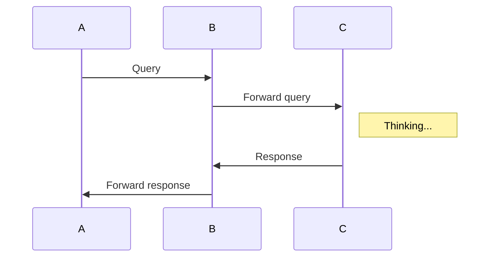

# Hello World

Hello, this is markdown $\alpha$.

$$
\alpha = \beta
$$

```python
import numpy as np

a = 1
b = 1
print(a + b)
```


```mermaid
sequenceDiagram
A->> B: Query
B->> C: Forward query
Note right of C: Thinking...
C->> B: Response
B->> A: Forward response
```
